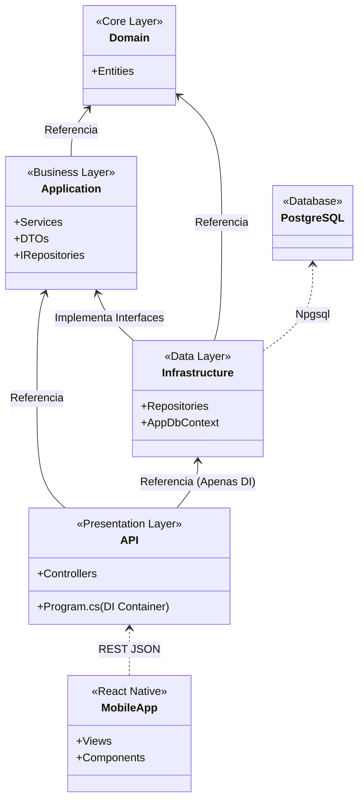

<div align="center">
  
# 💸 Dia5

[](#)
[](#)
[](#)

*Aplicativo moderno para divisão de despesas, gestão de repúblicas e acertos de contas entre amigos, desenhado com arquitetura limpa.*

</div>

---

## 📌 Sobre o Projeto

O **Dia5** é um aplicativo projetado para resolver o problema clássico de "quem deve a quem" em rolês, viagens e na convivência diária. Diferente de soluções comuns, ele possui a funcionalidade de **Shadow Users** (Usuários Convidados), permitindo adicionar amigos que não têm o app na divisão de contas, e depois vincular o histórico deles quando decidirem se cadastrar.

## 🚀 Principais Funcionalidades

* **Grupos de Despesas:** Crie grupos para eventos específicos e compartilhe um código de convite com seus amigos.
* **Shadow Users:** Inclua pessoas sem conta na divisão. Se elas baixarem o app depois, vincule o perfil facilmente através de um código!
* **Divisão Inteligente:** Registre quem pagou, defina quem participou e o sistema cuidará da matemática para que a conta feche exatamente.
* **Balanço Global (Acerto de Contas):** Veja de forma consolidada quanto você deve a cada amigo, cruzando os saldos de diferentes grupos.

## 🏗️ Arquitetura e Stack

O projeto segue os princípios de **Clean Architecture** (Arquitetura Limpa), separando o Domínio, a Aplicação e a Infraestrutura para garantir que a API seja facilmente testável e escalável.

* **Frontend:** React Native 
* **Backend:** C# (.NET Core)
* **Banco de Dados:** PostgreSQL com Entity Framework Core (EF Core)

### Diagrama de Dependências (.NET)



## 📚 Documentação Adicional

Todos os detalhes técnicos de especificação estão disponíveis nos seguintes documentos:

- 📋 [Requisitos Funcionais e Regras de Negócio](./requisitos.md)
- ⚙️ [Casos de Uso Detalhados](./casos%20de%20uso.md)
- 🗄️ [Modelo de Dados Relacional](./modelo%20de%20dados.md)
- 🏛️ [Arquitetura de Software](./arquitetura.md)

## 🛠️ Como Executar

### 1. Banco de Dados (Docker)
Para subir o banco de dados PostgreSQL e o pgAdmin:
```bash
# Iniciar os containers em background
docker compose up -d

# Parar os containers
docker compose down
```

* **PostgreSQL:** Rodando na porta `5432` com usuário `dia5_user` e banco `dia5_db`.
* **pgAdmin:** Acessível em `http://localhost:5050` com email `admin@dia5.com` e senha `admin`.

### 2. Backend (.NET 10 API)
Para restaurar as dependências e iniciar o servidor da API:
```bash
# Entrar na pasta do backend
cd backend

# Restaurar pacotes NuGet
dotnet restore

# Executar a API
dotnet run --project Dia5.API
```
A API estará acessível por padrão em `http://localhost:5000` ou `https://localhost:5001`.

### 3. Migrações do Entity Framework Core
Se precisar criar ou aplicar novas migrações de banco de dados:
```bash
# Instalar a ferramenta CLI do EF Core globalmente (caso não possua)
dotnet tool install --global dotnet-ef

# Aplicar migrações existentes no banco de dados
dotnet ef database update --project Dia5.Infrastructure --startup-project Dia5.API
```

### 4. Frontend (Vite + React)
Para rodar o frontend de teste:
```bash
# Entrar na pasta do frontend
cd front-teste/splitwise-premium

# Instalar as dependências
npm install

# Iniciar o servidor de desenvolvimento
npm run dev
```
O frontend estará acessível em `http://localhost:3000`.
