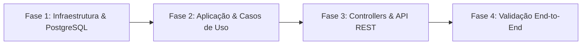

# Roteiro de Aprendizado e Implementação Completa do Backend (.NET 10)

Para quem está aprendendo **Clean Architecture**, o melhor caminho pedagógico é **concluir o fluxo do Backend de ponta a ponta primeiro**. 

Dessa forma, você verá sua API rodando no navegador via Swagger, salvando e lendo dados de verdade no PostgreSQL, antes de começar a tela do aplicativo mobile.

---

## 🎯 Visão Geral das Fases do Backend

---

## 🏛️ Fase 1: Infraestrutura, Mapeamento e PostgreSQL (`Dia5.Infrastructure`)

Nesta fase, conectaremos nossas entidades do Domínio (`Usuario`, `Despesa`, `Grupo`, `Pagamento`) ao banco de dados relacional.

### O que vamos implementar:
- Configuração da classe `AppDbContext` do Entity Framework Core.
- Mapeamento com **Fluent API** para chaves primárias compostas (`MembrosGrupo`, `ParticipantesDespesa`) e chaves estrangeiras.
- Configuração do comportamento de **Soft Delete** (`deleted_at`) global.
- Criação e execução da primeira migração (`dotnet ef migrations add InitialCreate`) no PostgreSQL do Docker.

### 📚 O que você vai estudar e aprender neste passo:
- **ORM (Object-Relational Mapper):** Entender como o Entity Framework traduz classes C# em tabelas SQL.
- **DbContext & DbSets:** O repositório central de dados na aplicação.
- **Fluent API:** Como definir regras de banco de dados diretamente no código C# sem precisar escrever comandos SQL na mão.
- **Migrations:** Como o .NET controla o histórico de alterações no esquema do banco de dados.

- **Status da Fase 1:** **100% Concluído** (Todas as 8 tabelas criadas no PostgreSQL via Docker e `dotnet ef database update`).

---

## ⚙️ Fase 2: Serviços de Aplicação e Contratos (`Dia5.Application`)

- **Status da Fase 2:** **80% Concluído** (Autenticação, DTOs, BCrypt e JWT implementados).

Nesta fase, criamos a camada que orquestra as ações do sistema (ex: registrar um usuário, fazer login, criar um grupo).

### O que já implementamos:
- [x] Definição de **Interfaces de Repositório** (`IUsuarioRepository`, `IDespesaRepository`, `IGrupoRepository`).
- [x] Criação de **DTOs** (`RegisterUserDto`, `LoginDto`, `AuthResponseDto`).
- [x] Instalação dos pacotes `BCrypt.Net-Next` e `System.IdentityModel.Tokens.Jwt`.
- [x] Implementação do `AuthService` com Hash de Senha BCrypt, Código de Perfil Único de 6 dígitos e Emissão de Token JWT.
- [ ] Implementação do `DespesaService` e `GrupoService`.

---

## 🌐 Fase 3: Exposição de Endpoints REST e Swagger (`Dia5.API`)

- **Status da Fase 3:** **50% Concluído** (`AuthController` e DI configurados).

Nesta fase, abrimos as portas do nosso backend para o mundo externo receber chamadas de rede.

### O que já implementamos:
- [x] Registro de dependências no container de DI em `Program.cs` (`AppDbContext`, Repositórios e `AuthService`).
- [x] Controller `AuthController` com rotas `POST /api/auth/register` e `POST /api/auth/login`.
- [ ] Controllers `DespesaController` e `GrupoController`.
- [ ] Configuração do Swagger UI interativo.

### 📚 O que você vai estudar e aprender neste passo:
- **Repository Pattern:** Por que a camada de aplicação só conversa com interfaces e não diretamente com a biblioteca de banco de dados.
- **DTOs vs Entidades:** Por que nunca expomos as entidades internas do banco de dados para a internet.
- **Hash Criptográfico de Senhas:** Por que senhas nunca são salvas como texto limpo e como funciona o algoritmo de hash.
- **Autenticação Stateless com JWT:** Como a API verifica se um usuário está logado usando tokens assinados.

---

## 🌐 Fase 3: Exposição de Endpoints REST e Swagger (`Dia5.API`)

Nesta fase, abriremos as portas do nosso backend para o mundo externo receber chamadas de rede.

### O que vamos implementar:
- Controllers RESTful: `AuthController`, `DespesaController`, `GrupoController`.
- Configuração da **Injeção de Dependências (DI Container)** no arquivo `Program.cs`.
- Tratamento global de erros e exceções com Middlewares.
- Configuração e personalização do **Swagger UI (OpenAPI)**.

### 📚 O que você vai estudar e aprender neste passo:
- **Padrão RESTful & Verbos HTTP:** Entender a diferença entre `POST` (criar), `GET` (ler), `PUT` (atualizar) e `DELETE` (deletar).
- **Injeção de Dependências (DI):** O conceito fundamental do .NET para gerenciar instâncias de classes de forma limpa (`AddScoped`, `AddTransient`).
- **Status Codes HTTP:** `200 OK`, `201 Created`, `400 Bad Request`, `401 Unauthorized`, `404 Not Found`.
- **Swagger UI:** Como usar a documentação interativa para testar a API direto do navegador.

---

## 🧪 Fase 4: Validação End-to-End (Swagger / Postman)

Nesta fase, faremos o teste completo da API rodando de verdade.

### O que faremos:
- Subir o PostgreSQL via Docker Compose.
- Iniciar a API .NET.
- Fazer o fluxo completo no Swagger:
  1. Cadastrar um Usuário Real.
  2. Fazer Login e obter o token JWT.
  3. Criar um Grupo de Despesas.
  4. Adicionar um Convidado (Shadow User).
  5. Cadastrar uma Despesa e verificar a divisão de saldos.

---

## 🚀 Próximo Passo
Com este plano aprovado, iniciaremos a **Fase 1: Infraestrutura e Mapeamento do PostgreSQL com EF Core**!
